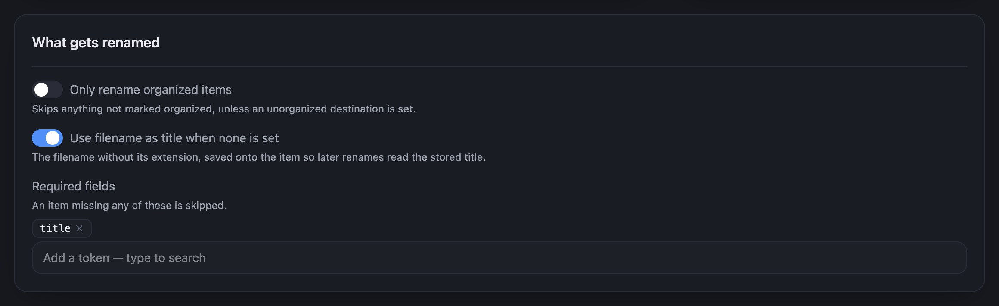
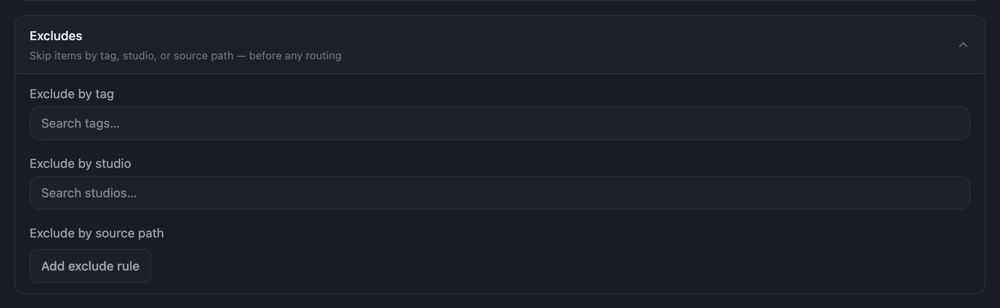

By default Renamer renames every item it can read a name for. Use the options below to narrow that
down. Each one takes effect after **Save changes**, and a dry run shows the result.

## Leave out a whole kind

Under **Where files go** → **Per kind**, select **Exclude** on the row for videos, images, audio or
text documents. Excluded kinds are left out of the dry run and of **Rename all files**. Select
**Include** to bring the kind back.

## Rename only organized items

Under **What gets renamed**, turn on **Only rename organized items**. Items whose **Organized** flag is
off in Cove are skipped.

## Skip items that are missing a field

**Required fields** lists tokens that must have a value. An item missing any of them is skipped, and
its dry-run row says **Needs a required field**. The default is `title`.

To add one, type in the box under **Required fields** and pick a token from the list. Select **×** on a
token to remove it.

## Skip a tag, a studio or a folder

1. Under **Advanced**, open **Excludes**.
2. Pick the tags or studios to skip under **Exclude by tag** or **Exclude by studio**. To skip a
   folder, add it under **Exclude by source path**.
3. Select **Save changes**.

Excludes are checked before any other rule. Excluding a studio also excludes its child studios.

## Good to know

- **Items with no title get one from their filename.** With **Use filename as title when none is
  set** on, which is the default, Renamer uses the filename as the title and saves it to the item in
  Cove. It is the only option that changes an item's metadata. Turn it off to skip untitled items
  instead.
- **Rename a handful by hand.** To rename just a few items, select them in a list instead. See
  [Rename a few items from a list](./rename-selected).
