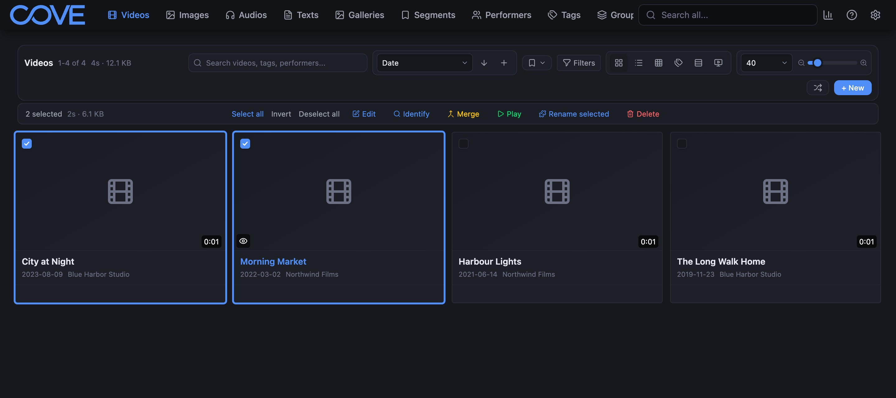

You don't have to rename the whole library. You can pick items in a list and rename only those,
using your saved Renamer settings.

## Rename selected items

1. Open **Videos**, **Images** or **Texts** in Cove.
2. Select the items you want to rename. The selection bar appears above the list.
3. Select **Rename selected**.
4. Read the confirmation. It says how many items will be renamed, shows up to five examples of old
   and new names, and warns about any that will be skipped or moved to another drive.
5. Select **OK** to rename, or **Cancel** to stop.

The rename runs in the background, and its progress shows in Cove's job drawer.

## Good to know

- **Audio has no Rename selected button.** Rename audio files with **Rename all files** on the
  Renamer page.
- **You need write permission** in Cove for the kind of item you are renaming. Without it the button
  does not appear.
- **A kind you excluded is skipped.** If you excluded a kind under **Per kind**, selected items of
  that kind are reported as skipped, and the reason names the kind.
- **The confirmation uses your saved settings.** Save any edits on the Renamer page first.
- **Undo works the same way.** A rename started here can be undone from the Renamer page. See
  [Undo a rename](./undo).
