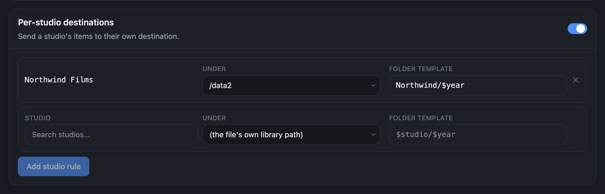

Routing rules send some items somewhere other than the default in **Where files go**. For example,
you can put everything from one studio on a second drive.

## Add a studio rule

1. On the Renamer page, go to **Destination routing**.
2. Turn on the switch beside **Per-studio destinations**.
3. In **Studio**, start typing a studio's name and select it from the list.
4. In **Under**, select the library path to move its items to.
5. In **Folder template**, type the folders to make under that path, for example `Northwind/$year`.
   Leave it blank to put the files directly in that library path.
6. Select **Add studio rule**, then **Save changes**.
7. Run a **Dry run** and check the **Destination** column.

A tag rule works the same way under **Per-tag destinations**.

## Which rule wins

Renamer checks rules in this order, and the first match decides where an item goes:

1. **Excludes**. A matched item is not renamed at all.
2. **Unorganized destination**, if you turned it on.
3. **Per-tag destinations**.
4. **Per-studio destinations**.
5. **Source-path destinations**.
6. The kind's **Own folder**, if it has one.
7. The default in **Where files go**.

## Good to know

- **A studio rule also covers its child studios.** A rule on a parent studio moves files from every
  child studio that has no rule of its own. Run a dry run before you save one.
- **A rule replaces the default folder template.** Its own folder template is used on its own, not
  added to the default one.
- **There are no per-performer rules.** You can use `$performers` in a name or folder template, but
  nothing routes on it.
- **The unorganized route comes first.** When **Unorganized destination** is on, an unorganized item
  goes there even if a studio or tag rule matches it.

## Related

- [Settings reference: Destination routing](../settings#destination-routing) covers source-path
  rules and the full precedence details.
