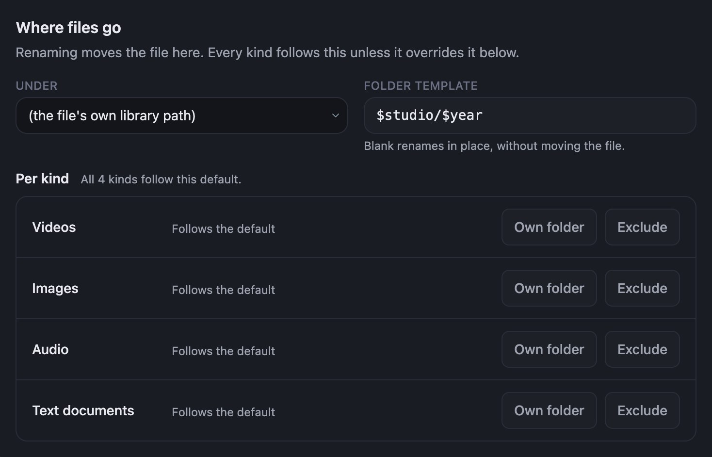

A folder template moves each file into folders built from its metadata when it is renamed.

```text
Folder template: $studio/$year

/data/VID_20210614_183022.mp4   →   /data/Northwind Films/2021/2021-06-14 - Harbour Lights.mp4
/data/final_final_v2.mp4        →   /data/Blue Harbor Studio/2019/2019-11-23 - The Long Walk Home.mp4
```

## Set a folder template

1. On the Renamer page, go to **Where files go**.
2. In **Folder template**, type the folders you want, separated by `/`. For example, `$studio/$year`.
3. Leave **Under** set to _(the file's own library path)_ to keep each file inside the library path
   it is in now. To gather everything under one library path instead, select that path in **Under**.
4. Select **Save changes**.
5. Under **Run & automation**, select **Dry run** and check the **Destination** column.



## Good to know

- **A blank folder template renames files where they are.** Nothing moves between folders.
- **An empty token drops its folder level.** An item with no studio goes straight into its `$year`
  folder rather than a folder with no name.
- **Only Cove's library paths are offered in Under.** Add a folder to Cove under **Settings** →
  **Library** → **Paths & Storage** before you can pick it.
- **Each kind can go somewhere else.** Select **Own folder** on a row under **Per kind** to give
  videos, images, audio or text documents a destination of their own. Select **Exclude** to leave a
  kind out entirely.
- **Rules can override the folder template.** To send one studio or tag somewhere else, see
  [Send a studio or tag to its own folder](./route-by-studio-or-tag).

## Related

- [Naming templates](../templates) lists every token you can use in a folder template.
- [Settings reference: Where files go](../settings#where-files-go) describes each field in detail.
