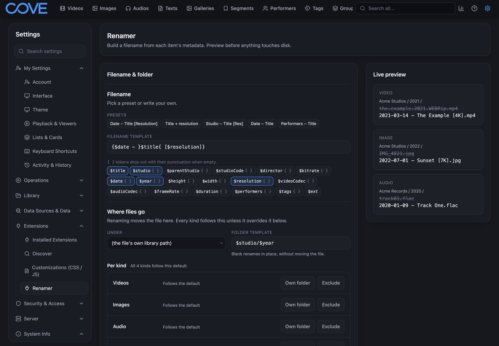

Renamer gives the files in your Cove library tidy, consistent names built from the metadata Cove
already has. It can also sort them into folders, such as one folder per studio and year.



## What it does

```text
Before                              After
/data/                              /data/
├── VID_20210614_183022.mp4         ├── Northwind Films/
├── clip_0007.mp4                   │   ├── 2021/2021-06-14 - Harbour Lights.mp4
├── final_final_v2.mp4              │   └── 2022/2022-03-02 - Morning Market.mp4
└── untitled-4.mp4                  └── Blue Harbor Studio/
                                        ├── 2019/2019-11-23 - The Long Walk Home.mp4
                                        └── 2023/2023-08-09 - City at Night.mp4
```

- **Names from your metadata.** Pick a preset or write a template such as
  `{$date - }$title{ [$resolution]}`. Renamer fills it in for each item.
- **Nothing moves until you say so.** A dry run lists every old name, new name and destination
  first.
- **Cove stays in step.** The file on disk and its record in Cove change together, so nothing goes
  missing from your library.
- **Undo.** The last rename can be put back for 7 days.

Renamer works on videos, images, audio files and text documents.

## Where to start

- **New to Renamer?** Follow the [Quick start](./renamer/quick-start). It takes about five minutes.
- **Want something specific?** The how-to guides cover
  [sorting files into folders](./renamer/how-to/sort-into-folders),
  [sending a studio or tag to its own folder](./renamer/how-to/route-by-studio-or-tag),
  [choosing which files get renamed](./renamer/how-to/choose-what-gets-renamed),
  [renaming a few items from a list](./renamer/how-to/rename-selected),
  [renaming automatically](./renamer/how-to/rename-automatically) and
  [undoing a rename](./renamer/how-to/undo).
- **Something looks wrong?** See [Troubleshooting](./renamer/troubleshooting).
- **Looking up a detail?** The [Naming templates](./renamer/templates) and
  [Settings reference](./renamer/settings) pages list every token and every setting.

## What you need

- Cove 1.5.0 or later.
- Write permission in Cove for the kinds of item you want to rename, and read permission to preview
  them.
