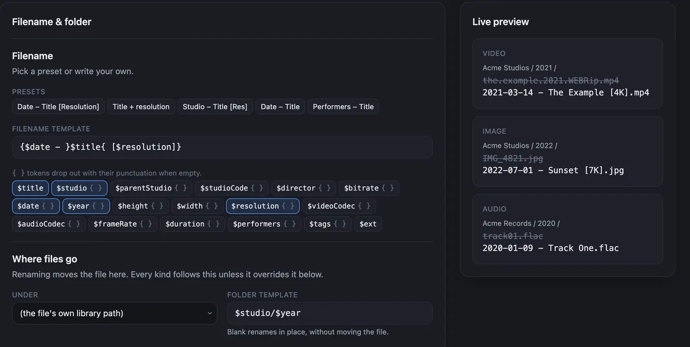
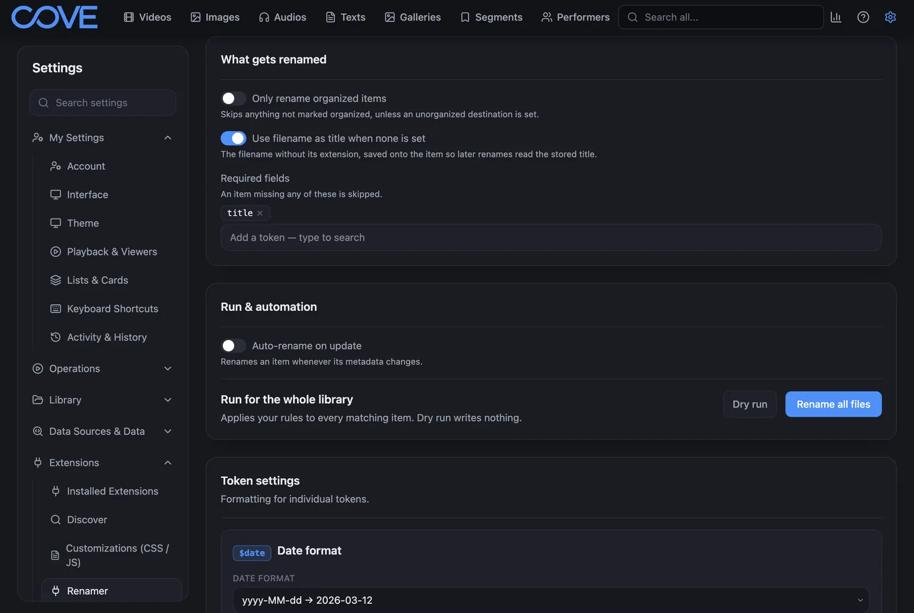
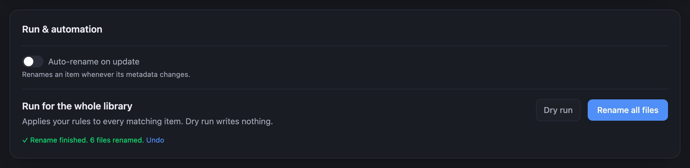

This guide takes you from installing Renamer to your first rename. Nothing on disk changes until the
last step, and you can undo that step too.

## 1. Install Renamer

1. In Cove, open **Settings**, and under **Extensions** select **Discover**.
2. Search for **Renamer**, then select **Install**.

Renamer then appears as its own page under **Extensions** in the settings menu.

:::tip[Install a specific release]
To install a release from [GitHub](https://github.com/alextomas955/cove-extensions/releases), select
the **⋯** button beside the search box on the **Discover** page. Then select **Install from ZIP…** for
a downloaded file, or **Install from URL…** for its download link.
:::

## 2. Open the Renamer page

In **Settings**, under **Extensions**, select **Renamer**.

The page opens on the **Filename & folder** card. The **Live preview** beside it shows three sample
files. The crossed-out line is the name a file has now, and the line below it is the name it would
get.

## 3. Pick a naming pattern

Select one of the **Presets**, or type your own pattern in **Filename template**. The preview updates
as you go.

A pattern is plain text plus `$tokens` that Renamer fills in from each item, such as `$title`,
`$studio` or `$year`. Anything inside `{ }` disappears when its token is empty, so a missing date
never leaves a stray dash. [Naming templates](./templates) lists every token.

To sort files into folders as well, fill in **Folder template** under **Where files go**, for example
`$studio/$year`. Leave it blank to rename files where they are.

When the preview looks right, select **Save changes** at the bottom of the page.

## 4. Preview with a dry run

Under **Run & automation**, select **Dry run**. Renamer scans your library and lists what it would do,
without changing anything.

Each row shows a file's current name, its new name and the folder it would move to. Use the buttons
at the top to show only the rows that need attention. If a row has a badge, it tells you why that
file will not be renamed. [Troubleshooting](./troubleshooting#dry-run-badges) explains each badge.

If something looks wrong, select **Close**, adjust the template and run the dry run again.

## 5. Rename

When the list looks right, select **Rename _N_ files** at the bottom of the dry run. You can also
select **Rename all files** on the page itself.

When the rename finishes, a green line under the buttons says how many files it renamed and how
many it skipped.

## Undo it if you change your mind

The foot of the Renamer page shows your last rename and an **Undo last rename** button. Select it
and confirm, and Renamer moves the files back. See [Undo a rename](./how-to/undo) for what undo
covers.

## Next steps

- [Sort files into folders](./how-to/sort-into-folders)
- [Send a studio or tag to its own folder](./how-to/route-by-studio-or-tag)
- [Choose which files get renamed](./how-to/choose-what-gets-renamed)
- [Rename a few items from a list](./how-to/rename-selected)
