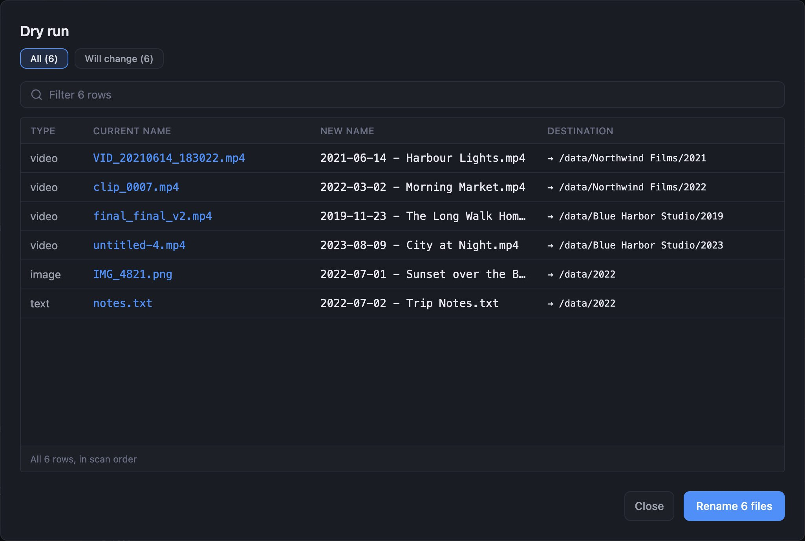

## Dry-run badges

Every row in a dry run says what will happen to that file. A row that will be renamed has no badge,
unless its name was adjusted. A row that won't be renamed has a badge that gives the reason.

### Rows that will be renamed

| Badge                          | What it means                                                                |
| ------------------------------ | ---------------------------------------------------------------------------- |
| **Numbered to avoid a clash**  | Another file already has that name, so Renamer adds a number such as `(1)`.  |
| **Cleaned for the filesystem** | Characters your system doesn't allow in a filename were removed or replaced. |
| **No change needed** (gray)    | The file already has the name and folder your settings give it.              |

### Rows that need attention

| Badge                                                  | Why it stopped                                                            | What to do                                                                   |
| ------------------------------------------------------ | ------------------------------------------------------------------------- | ---------------------------------------------------------------------------- |
| **Needs a required field**                             | A token in **Required fields** is empty for this item.                    | Fill in that field in Cove, or remove it from **Required fields**.           |
| **An exclude rule matched**                            | One of your exclude rules covers this item.                               | Nothing, if that's intended. Otherwise edit **Excludes** under **Advanced**. |
| **A regex rule timed out**                             | A path pattern took too long on this item's folder, so it was left alone. | Simplify the pattern the reason names.                                       |
| **Name conflict**                                      | Another file already has the new name, and Renamer never overwrites.      | Rename or remove the other file, or change your template.                    |
| **File missing on disk**                               | Cove has a record for a file that isn't there.                            | Check where the file went, then rescan the library in Cove.                  |
| **File in use**                                        | Another program had the file open.                                        | Close that program and run again.                                            |
| **Permission denied**                                  | Cove isn't allowed to write to the destination, or to move the file.      | Fix the folder permissions for the account Cove runs as.                     |
| **File is outside your Cove library**                  | The file isn't under any of Cove's library paths.                         | Add its folder to Cove's library paths, or pick a library path in **Under**. |
| **The rule's destination is no longer a library path** | The library path a rule points at was removed from Cove.                  | Pick another path for the rule, or add the folder back in Cove.              |
| **Destination outside its own root**                   | The folder template isn't relative, or it climbs out of its destination.  | Make the folder template relative, such as `$studio/$year`.                  |
| **Path too long**                                      | The full path would be longer than **Full-path max length**.              | Shorten the folder template or the filename template.                        |
| **Cancelled** (gray)                                   | Cove shut down during the run. Nothing was half-written.                  | Run the rename again. It picks this file up.                                 |

### Red badges

- **Too long to copy across drives.** This file moves to another drive. Renamer first copies it to a
  temporary name beside the destination, which is slightly longer than the final path, and that
  temporary path is too long. Shorten the destination folder or the filename template for this file.
- **Copy did not verify.** The copy to the other drive didn't match the original, so the file was
  left where it was. Check the destination drive before you try again.
- **Failed — rolled back.** The rename of this file failed part-way, and Renamer put it back as it
  was.

## Rename messages

After a rename from the Renamer page, a message under the buttons tells you how it went.

| Message                                                  | What it means                                                                                                                                                                                    |
| -------------------------------------------------------- | ------------------------------------------------------------------------------------------------------------------------------------------------------------------------------------------------ |
| **Rename finished. The scan found 412 files to rename.** | The run completed. The numbers come from the scan before the run, so a file can still have been skipped. Run a dry run to see where things stand.                                                |
| **Stopped: insufficient free space for Video.**          | A destination drive filled up. That kind stopped and the others carried on. Files renamed before the stop stay renamed, and undo covers them.                                                    |
| **Couldn't rename - _reason_. Nothing was changed.**     | Cove reported that the job failed before writing anything. Fix the cause it names and run again.                                                                                                 |
| **Couldn't confirm the rename - _reason_.**              | Renamer stopped waiting before the job reported back. The job may still be running and may have renamed files. Reload the page and check your library and the undo line before you run it again. |

### Two records point at the same file

If two items in Cove point at the same file on disk, Renamer renames neither. It can't tell which one
owns the file. The run counts these as refused, and Cove's log names the path. Remove the duplicate
item in Cove and run again.

### The old file is still there after a cross-drive rename

The file was copied, checked and put in place, so the rename is done. The original couldn't be
deleted, usually because something had it open. Delete it yourself once it is free.

## Undo

- **After a partial undo, the line shows what is left.** For example, "37 of 500 restored" and a button
  offering the remaining 463. Files that can never go back are counted separately.
- **A file that is no longer in your library can't be restored.** Renamer reads a file's current
  location from Cove.
- **If Cove was killed during a rename, the last few hundred files may not be undoable.** Renamer
  records moves in groups, and a crash loses the group it had not written yet. Those files are renamed
  correctly and Cove knows where they are. Only the automatic undo is lost for them.
- **A companion file can stay behind.** The result then reads, for example, "Undone - 40 files moved
  back to their original names. 2 companion files stayed behind", followed by which ones and why.
- **Undo doesn't re-create a folder that was deleted.** If **Delete the source folder when a move
  leaves it empty** removed a folder, undo doesn't bring it back.
- **Undo survives an update or reinstall of Renamer.** The record lives in Cove's database.

## Settings page

### Save is turned off after an upgrade

After upgrading from an older Renamer, the page may say your tag, performer or destination rules are
waiting for a one-time conversion, and **Save** is turned off. Restart Cove and reload the page.

The destination conversion also needs at least one library path in Cove. If you have none, add one,
then restart Cove and reload the page.

### Dry run and Rename all files show different results

A dry run uses your current edits, including ones you haven't saved. **Rename all files** uses saved
settings only, and it is turned off while you have unsaved edits. Save first.

### The totals are different from what I expected

Renamer keeps one scan result for the whole Cove, so the totals you see may come from someone else's
most recent dry run. They are also limited to the kinds of item your account can read. Run a new dry
run for figures of your own.
